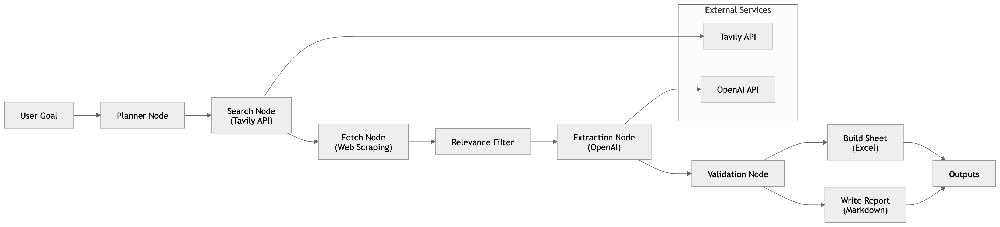

# AI Research Agent

An AI-powered multi-step research agent that automates competitor analysis for enterprise tools by combining planning, web search, content extraction, and structured report generation.

## Overview

This project simulates how a product manager or analyst conducts competitive research—but automates the entire workflow using an AI agent pipeline.

Given a high-level research goal, the system:

1. Breaks it into structured research questions
2. Searches the web for relevant sources
3. Fetches and processes full-page content
4. Extracts structured insights using LLMs
5. Generates a comparison spreadsheet and report

---

## Example Use Case

**Input:**

```
Analyze top observability platforms for enterprise engineering teams
```

**Output:**

* Structured research plan
* Comparison spreadsheet (`.xlsx`)
* Markdown report (`.md`) with:

  * Vendors (Datadog, New Relic, etc.)
  * ICP (Ideal Customer Profile)
  * Strengths / Weaknesses
  * AI capabilities
  * Pricing insights
  * Source-backed evidence

---

## Architecture

The system is built as a modular agent pipeline:

```
Planner → Search → Fetch → Filter → Extract → Validate → Output
```


### Components

* **Planner Node**

  * Converts goal into structured research questions

* **Search Node**

  * Uses Tavily API to retrieve relevant sources

* **Fetch Node**

  * Scrapes full-page content from URLs

* **Relevance Filter**

  * Removes off-topic sources using keyword scoring

* **Extraction Node**

  * Uses OpenAI to convert unstructured text into structured competitor data

* **Validation Node**

  * Deduplicates and filters low-confidence results

* **Output Nodes**

  * Generates:

    * Excel comparison sheet
    * Markdown research report

---

## Tech Stack

* Python
* FastAPI
* LangGraph (agent orchestration)
* OpenAI API
* Tavily API (web search)
* BeautifulSoup (web scraping)
* Pandas / Excel export

---

## How to Run

### 1. Clone the repo

```bash
git clone https://github.com/your-username/AI-research-agent.git
cd AI-research-agent
```

### 2. Set up environment

```bash
python3 -m venv .venv
source .venv/bin/activate
pip install -r requirements.txt
```

### 3. Configure `.env`

```env
OPENAI_API_KEY=your_openai_key
OPENAI_MODEL=gpt-4.1-mini
TAVILY_API_KEY=your_tavily_key
```

### 4. Start the API

```bash
uvicorn app.api:app --reload
```

### 5. Run a research query

```bash
curl -X POST "http://127.0.0.1:8000/research/run" \
  -H "Content-Type: application/json" \
  -d '{"goal":"Analyze top observability platforms for enterprise engineering teams"}'
```

---

## Output

Generated files are saved in:

```
data/outputs/
```

* `comparison.xlsx` → structured vendor comparison
* `report.md` → human-readable research report

---

## Key Design Decisions

* **Agent-based architecture**
  Enables modular reasoning and extensibility

* **Structured extraction schema**
  Forces consistency across sources

* **Relevance filtering layer**
  Reduces noise from generic or unrelated content

* **Full-page content retrieval**
  Improves accuracy vs. snippet-only extraction

---

## Limitations

* Some websites block scraping (e.g., Gartner, Medium)
* Extraction quality depends on source quality
* Vendor-level aggregation is not yet implemented
* Some inferred fields may require human validation

---

## Future Improvements

* Vendor normalization (merge multiple sources per company)
* Confidence scoring across multiple sources
* PDF ingestion (analyst reports, whitepapers)
* UI dashboard for interactive research exploration
* Caching + incremental updates

---

## Why This Project

Competitive intelligence is a critical but manual workflow for product teams. This project demonstrates how AI agents can:

* Automate research workflows
* Structure unstructured web data
* Accelerate decision-making
* Bridge LLM capabilities with real-world product use cases

---

## Author

Abhishek Bhor
Product | AI, UX, Business
